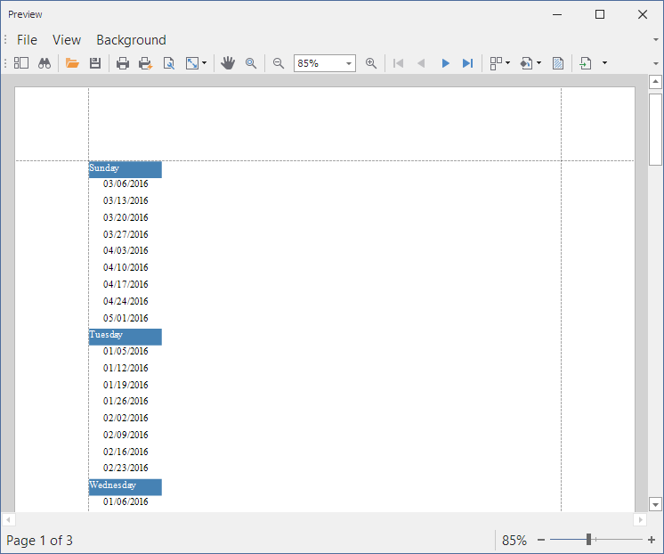

<!-- default badges list -->

<!-- default badges end -->
# Reporting for WinForms - How to Group Report Data by Days of the Week

The report in this example groups orders by day of the week taken from the order date. Orders are grouped by a calculated field that contains the day of the week for the Order data record.

## Files to Look At

- [Form1.cs](CS/GroupByTimeSpan/Form1.cs) ([Form1.vb](VB/GroupByTimeSpan/Form1.vb))

## Documentation 

- [Group Data by Days of the Week](https://docs.devexpress.com/XtraReports/5751)

<!-- feedback -->
## Does this example address your development requirements/objectives?

 

(you will be redirected to DevExpress.com to submit your response)
<!-- feedback end -->
